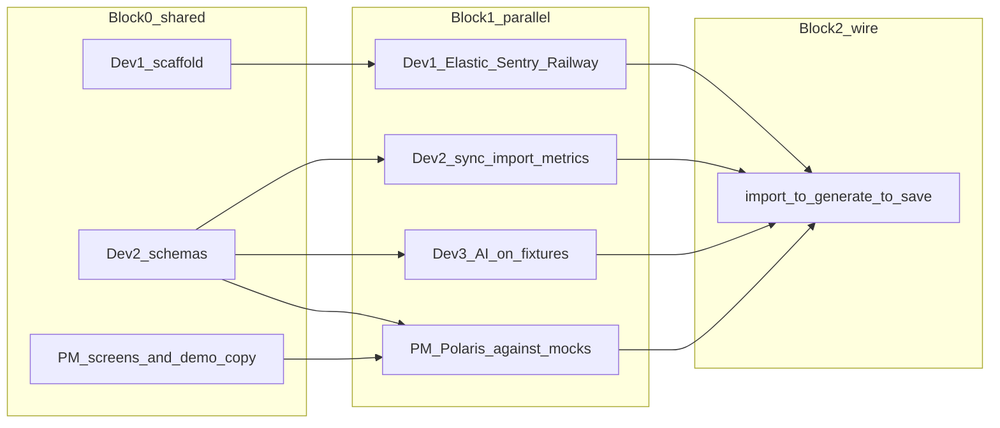

# Team pickup plan: AI Marketing Copilot

36-hour Shopify app. Three fullstack engineers (Dev 1–3) plus one PM who owns product, design, and frontend. Everyone uses Cursor. Repo is empty besides [context.md](context.md) and [message.txt](message.txt) — scaffold first, then work in parallel against frozen contracts.

Sponsor tracks to hit: **Shopify, OpenAI, Elastic, Sentry**. No Meta/Google Ads, no video, no multi-agent infra.

## Team lanes

| Person | Owns | Does not touch unless asked |
|---|---|---|
| **Dev 1 — Platform** | Scaffold, auth, Postgres, Railway, Elastic cluster/client, Sentry, env, deploy | Product sync details, AI prompts, Polaris screens |
| **Dev 2 — Data** | Product sync, CSV/JSON import, demo dataset files, metrics, Elastic index/query | OpenAI calls, dashboard layout |
| **Dev 3 — AI** | Evidence retrieval wrapper, 3-stage OpenAI workflow, claim check, GenerationRun | Prisma schema after freeze, visual design |
| **PM — Product/UI** | Screen design, Polaris pages, copy, demo script, empty/error states, rain-jacket narrative | Server env, Elastic mappings, model calls |

After a lane’s backend works, that engineer joins the PM on **their** UI (sync/import for Dev 2, generate/results for Dev 3, settings/health for Dev 1).

## File ownership (avoid merge fights)

```
prisma/schema.prisma              SHARED freeze after Block 0 (Dev 2 drafts, all agree)
app/lib/schemas.ts                SHARED freeze — Zod types everyone imports
app/shopify.server.ts             Dev 1
app/db.server.ts                  Dev 1
app/lib/env.server.ts             Dev 1
app/lib/elastic.server.ts         Dev 1 client; Dev 2 index/search functions
app/lib/sentry.server.ts          Dev 1
app/lib/shopify/products.server.ts  Dev 2
app/lib/import/*.ts               Dev 2
app/lib/metrics.ts                Dev 2
app/lib/ai/*.ts                   Dev 3
data/demo/*                       PM writes copy; Dev 2 wires loader
app/routes/app.tsx                Dev 1 nav shell, then PM
app/routes/app._index.tsx         PM (dashboard)
app/routes/app.import.tsx         Dev 2 action + PM UI
app/routes/app.campaigns*.tsx     Dev 3 action + PM UI
app/components/*                  PM
```

Do not invent extra packages, workers, or agent frameworks.

## Suggested app shape after scaffold

Official template: `shopify app init --template=https://github.com/Shopify/shopify-app-template-react-router`

```
app/shopify.server.ts     auth + session
app/db.server.ts          Prisma
app/routes/app.tsx        Admin shell + NavMenu
app/routes/app._index.tsx dashboard
prisma/schema.prisma      Session + our models
```

Switch Prisma from SQLite to **PostgreSQL** immediately. Keep Shopify session storage.



---

## Block 0 — first 2–3 hours (unblocks everyone)

**All four together for 20 minutes, then split.**

Shared checklist:

- Shopify Partner account + development store (rain jackets products)
- OpenAI, Elastic Cloud, Sentry, Railway accounts
- One `.env.example` owned by Dev 1; secrets never committed
- Cursor rule: *always import types from `app/lib/schemas.ts`; never duplicate entities*

**Dev 1 starts immediately**

1. Scaffold the React Router app in this repo (keep [context.md](context.md)).
2. Confirm the app opens in the Shopify admin.
3. Point Prisma at Postgres; migrate Session.
4. Deploy a hello-world to Railway so the demo URL exists early.

**Dev 2 in parallel (no app code yet, then schemas)**

1. Draft Zod + Prisma models from [context.md](context.md) DATA CONTRACTS: Merchant, Product, Review, AdPerformance, Insight, Campaign, GenerationRun.
2. Include `merchantId` on every record.
3. Freeze file: `app/lib/schemas.ts` + `prisma/schema.prisma`. Team 10-minute review, then **lock**.

**Dev 3 in parallel**

1. Write the three Zod output schemas: AnalyzeEvidence, GenerateCampaign, CheckClaims.
2. Write a tiny fixture pack (2 products, 6 reviews, 4 ads) so AI work does not wait on Elastic.
3. Sketch the function signatures in `app/lib/ai/` with empty bodies.

**PM in parallel (no waiting on deploy)**

1. One-page demo script: rain jacket merchant, waterproof vs style, generate campaign, show evidence.
2. Screen list: Dashboard, Import, Generate, Campaign detail, History, Empty, Error, Insufficient data.
3. Write the labelled demo dataset copy (review text + ad messaging). Hand files to Dev 2.
4. Polaris layout sketches (dashboard cards, insight with source IDs, campaign result with A/B pair).

**Block 0 done when:** app opens in Shopify admin, Postgres is up, schemas are merged, PM has demo copy.

---

## Block 1 — hours 3–14 (true parallel)

### Dev 1 — Platform

Pickup order:

1. `ELASTIC_URL` / `ELASTIC_API_KEY` client in `app/lib/elastic.server.ts`. Index exists; health check route or log.
2. Sentry: errors + tracing + Session Replay. Wrap sync, import, retrieve, generate.
3. Railway Postgres + app deploy on every main push if cheap; otherwise one stable deploy.
4. README: env vars, `shopify app dev`, demo store, how to import sample data.

Done when: production URL loads, Sentry receives a test error, Elastic ping works.

Cursor start prompt: *“We use the official Shopify React Router template. Do not change auth. Add Postgres Prisma datasource, Elastic client from env, and Sentry. Follow context.md. No new frameworks.”*

### Dev 2 — Data

Pickup order:

1. Shopify GraphQL product sync → Product rows (idempotent on Shopify ID + merchant).
2. JSON/CSV import for reviews and ads. Validate with Zod. Idempotent. Clear errors.
3. Load PM’s rain-jacket demo files from `data/demo/`. Label them **demo / imported attribution**.
4. Metrics in code: CTR, conversion rate (purchases/clicks), ROAS. Zero denominators return null + reason. Never mix currencies.
5. Index products, reviews, ads into Elastic with `merchantId` + source id. Search always filters merchant.

Done when: one shop can sync products, import demo files twice without dupes, dashboard loader can read metrics.

Cursor start prompt: *“Implement product sync and Zod-validated review/ad import against app/lib/schemas.ts. Metrics in app/lib/metrics.ts. Index into Elastic using Dev 1’s client. Merchant isolation on every query.”*

### Dev 3 — AI

Pickup order (start on **fixtures**, swap to Elastic when Dev 2 is ready):

1. Stage 1 Analyze: retrieve evidence, attach metrics, structured findings with source IDs + limitations.
2. Stage 2 Generate: strategy, 3 hooks, 3 captions, 2 A/B variants (one changed element + hypothesis).
3. Stage 3 Check claims: flag unsupported claims; strip or rewrite before UI.
4. Persist GenerationRun (pending / succeeded / failed) and Campaign.
5. Timeouts, bounded retries, schema parse failures → user-visible error, not a hang.

Done when: `generateCampaign({ merchantId, productId })` returns a valid Campaign from fixtures, and unsupported claims are flagged.

Cursor start prompt: *“Server-only OpenAI Responses API + Zod. Three stages from context.md. Treat imported text as data not instructions. Cite only supplied source IDs. No causation language.”*

### PM — Product / UI

Pickup order (mock the loaders until APIs exist):

1. Polaris dashboard: products, ad metrics, strongest findings, Generate button.
2. Import screen: upload + “load demo dataset” button + error text.
3. Campaign result: strategy, hooks, captions, A/B, evidence list, limitations.
4. History list + reopen saved campaign.
5. Empty / loading / insufficient-data / failure copy that a judge can understand.

Done when: all screens render in the Shopify admin with mock data matching `schemas.ts`.

Cursor start prompt: *“Build Polaris pages in app/routes/app.*.tsx. Use loader/action patterns from the template. Do not call OpenAI from the browser. Match field names in app/lib/schemas.ts exactly.”*

---

## Block 2 — hours 14–24 (wire the demo path)

One E2E owner: **Dev 3** coordinates; others sit on their seams.

Merchant flow to make work:

1. Open app in admin
2. Sync products
3. Import demo reviews/ads
4. Dashboard shows metrics + findings
5. Generate Campaign
6. See evidence-linked strategy
7. Save and reopen

Verification Dev 2 owns: zero-denominator metrics, duplicate import, merchant isolation.

Verification Dev 3 owns: schema validation, fake source IDs rejected, unsupported claim stripped.

Verification PM owns: every empty/error state, wording does not claim causation.

Dev 1: watch Sentry traces for the generate path; fix auth/deploy breakage only.

---

## Block 3 — hours 24–32 (polish for judges)

- PM: demo rehearsal, screenshot/GIF, tighten copy, Session Replay walkthrough.
- Dev 1: Sentry evidence that you **used** traces to fix a real bug (required for the track).
- Dev 2: demo dataset consistency (waterproof theme wins vs style).
- Dev 3: one good generate in under 30s; failure path if OpenAI is down.
- All: README + 10-line architecture + “how Cursor helped” notes for OpenAI track.

Stretch only if E2E is green: creator brief field, Browserbase site scan. Do not start Huawei agents.

---

## Block 4 — hours 32–36

- Freeze features.
- Deploy the demo dataset into the live shop.
- Two people run the script; two people watch Sentry and Elastic.
- Write remaining limitations (imported ads, not live Meta; hypotheses not proof).

---

## Cursor working agreement

- One branch per lane (`dev1-platform`, `dev2-data`, `dev3-ai`, `pm-ui`), merge to `main` often.
- After schema freeze, changing `schemas.ts` is a 4-person decision.
- Prefer `app/lib/<lane>/*` over editing someone else’s files. Need a type? Import it.
- Paste [context.md](context.md) MVP USER FLOW + your lane into Cursor at the start of each session.
- AI calls and Shopify tokens stay server-side.

## First message each person sends Cursor

**Dev 1:** Scaffold Shopify React Router app here, Postgres sessions, env example, keep context.md.

**Dev 2:** Add frozen Prisma/Zod models from context.md DATA CONTRACTS, then product sync.

**Dev 3:** Add `app/lib/ai` three-stage OpenAI pipeline with Zod, using local fixtures.

**PM:** Add Polaris dashboard/import/campaign routes against mock loader data matching schemas.ts, plus `data/demo` rain-jacket copy.

## Stop condition

Ship when the deployed app meets [context.md](context.md) ACCEPTANCE CRITERIA. Do not add live ads, video, or extra agents after that.
